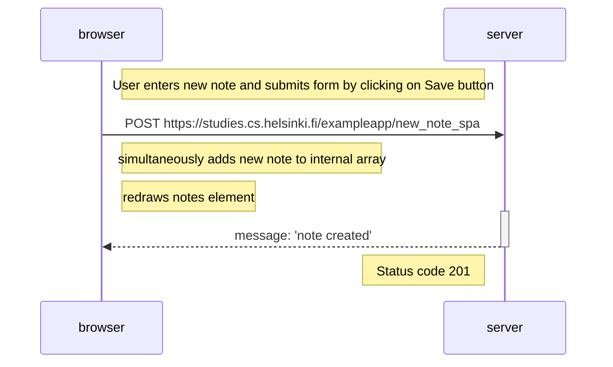

```mermaid
sequenceDiagram
    participant browser
    participant server

    Note right of browser: User enters new note and submits form by clicking on Save button
    browser->>server: POST https://studies.cs.helsinki.fi/exampleapp/new_note_spa

    Note right of browser: simultaneously adds new note to internal array
    Note right of browser: redraws notes element
    
    activate server
    server-->>browser: message: 'note created'
    deactivate server
    
    Note left of server: Status code 201
```
